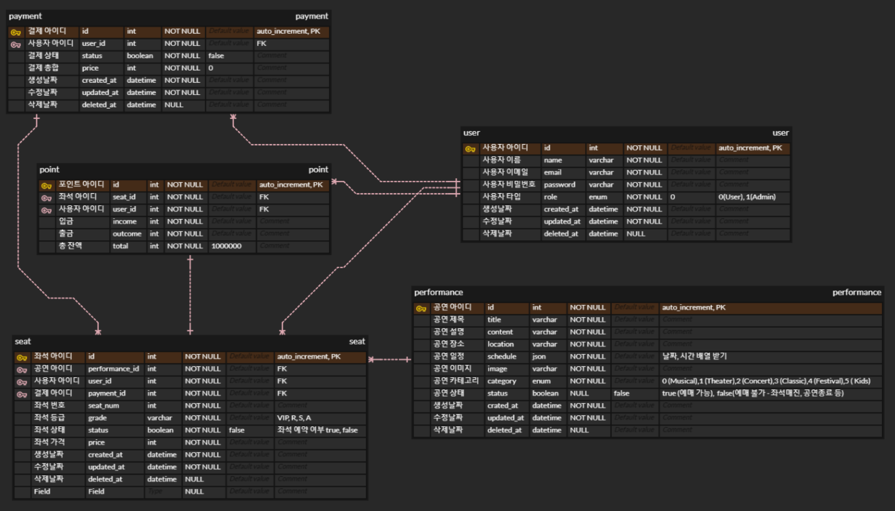

# Sooterpark

공연 예매 API 설계 프로젝트

<p align="center">
  <a href="http://nestjs.com/" target="blank"></a>
</p>

[circleci-image]: https://img.shields.io/circleci/build/github/nestjs/nest/master?token=abc123def456
[circleci-url]: https://circleci.com/gh/nestjs/nest

# ERD



## Main Directory structure

```
📦api-docs
 ┣ 📜payment.http
 ┣ 📜performance.http
 ┗ 📜user.http
📦src
 ┣ 📂auth
 ┃ ┣ 📜auth.middleware.ts
 ┃ ┣ 📜auth.module.ts
 ┃ ┣ 📜jwt.strategy.ts
 ┃ ┣ 📜naver-auth.guard.ts
 ┃ ┣ 📜naver.strategy.ts
 ┃ ┣ 📜roles.decorator.ts
 ┃ ┗ 📜roles.guard.ts
 ┣ 📂payment
 ┃ ┣ 📂dto
 ┃ ┃ ┣ 📜create-payment.dto.ts
 ┃ ┃ ┗ 📜update-payment.dto.ts
 ┃ ┣ 📂entities
 ┃ ┃ ┗ 📜payment.entity.ts
 ┃ ┣ 📂types
 ┃ ┃ ┗ 📜paymentStatus.types.ts
 ┃ ┣ 📜payment.controller.ts
 ┃ ┣ 📜payment.module.ts
 ┃ ┗ 📜payment.service.ts
 ┣ 📂performance
 ┃ ┣ 📂dto
 ┃ ┃ ┣ 📜create-performance.dto.ts
 ┃ ┃ ┗ 📜update-performance.dto.ts
 ┃ ┣ 📂entities
 ┃ ┃ ┗ 📜performance.entity.ts
 ┃ ┣ 📂types
 ┃ ┃ ┗ 📜performanceCategory.type.ts
 ┃ ┣ 📜performance.controller.ts
 ┃ ┣ 📜performance.module.ts
 ┃ ┗ 📜performance.service.ts
 ┣ 📂point
 ┃ ┣ 📂dto
 ┃ ┃ ┣ 📜create-point.dto.ts
 ┃ ┃ ┗ 📜update-point.dto.ts
 ┃ ┣ 📂entities
 ┃ ┃ ┗ 📜point.entity.ts
 ┃ ┣ 📜point.controller.ts
 ┃ ┣ 📜point.module.ts
 ┃ ┗ 📜point.service.ts
 ┣ 📂schedule
 ┃ ┣ 📂dto
 ┃ ┃ ┣ 📜create-schedule.dto.ts
 ┃ ┃ ┗ 📜update-schedule.dto.ts
 ┃ ┣ 📂entities
 ┃ ┃ ┗ 📜schedule.entity.ts
 ┃ ┣ 📜schedule.controller.ts
 ┃ ┣ 📜schedule.module.ts
 ┃ ┗ 📜schedule.service.ts
 ┣ 📂seat
 ┃ ┣ 📂dto
 ┃ ┃ ┣ 📜create-seat.dto.ts
 ┃ ┃ ┗ 📜update-seat.dto.ts
 ┃ ┣ 📂entities
 ┃ ┃ ┗ 📜seat.entity.ts
 ┃ ┣ 📂types
 ┃ ┃ ┗ 📜seatGrade.type.ts
 ┃ ┣ 📜seat.controller.ts
 ┃ ┣ 📜seat.module.ts
 ┃ ┗ 📜seat.service.ts
 ┣ 📂user
 ┃ ┣ 📂dto
 ┃ ┃ ┣ 📜login.dto.ts
 ┃ ┃ ┗ 📜register.dto.ts
 ┃ ┣ 📂entities
 ┃ ┃ ┗ 📜user.entity.ts
 ┃ ┣ 📂types
 ┃ ┃ ┗ 📜userRole.type.ts
 ┃ ┣ 📜user.controller.ts
 ┃ ┣ 📜user.module.ts
 ┃ ┗ 📜user.service.ts
 ┣ 📂utils
 ┃ ┗ 📜userInfo.decorator.ts
 ┣ 📜app.controller.ts
 ┣ 📜app.module.ts
 ┣ 📜app.service.ts
 ┗ 📜main.ts
```

## .env setting

```
DB_USERNAME
DB_PASSWORD
DB_HOST
DB_NAME
DB_PORT
DB_SYNC
NAVER_CLIENT_ID=
NAVER_CLIENT_SECRET
NAVER_CALLBACK_URL
JWT_SECRET_KEY
```

## Installation

```bash
$ npm install
```

## Running the app

```bash
# development
$ npm run start

# watch mode
$ npm run start:dev

# production mode
$ npm run start:prod
```

## Test

```bash
# unit tests
$ npm run test

# e2e tests
$ npm run test:e2e

# test coverage
$ npm run test:cov
```
